<a href="https://meridian-ai.vercel.app">
  
  <h1 align="center">Meridian AI</h1>
</a>

<p align="center">
  An intelligent multi-agent system that analyzes 987 healthcare facilities across Ghana, helping NGO coordinators, volunteer doctors, and healthcare planners bridge medical deserts.
</p>

<p align="center">
  <a href="https://meridian-ai.vercel.app"></a>
  <a href="#architecture"></a>
  <a href="#tech-stack"></a>
  <a href="#tech-stack"></a>
  <a href="#tech-stack"></a>
  <a href="LICENSE"></a>
</p>

<p align="center">
  <a href="#what-is-meridian-ai"><strong>What is Meridian AI?</strong></a> ·
  <a href="#features"><strong>Features</strong></a> ·
  <a href="#try-these-prompts"><strong>Try These Prompts</strong></a> ·
  <a href="#architecture"><strong>Architecture</strong></a> ·
  <a href="#tech-stack"><strong>Tech Stack</strong></a> ·
  <a href="#getting-started"><strong>Getting Started</strong></a>
</p>
<br/>

<p align="center">
  <a href="https://meridian-ai.vercel.app">
    
  </a>
</p>

## What is Meridian AI?

**Meridian AI** is an AI-powered healthcare intelligence platform built for the [Virtue Foundation](https://virtuefoundation.org/) as part of the Databricks **Bridging Medical Deserts** hackathon.

Ghana's healthcare infrastructure is unevenly distributed — rural communities often lack basic medical services while urban centers are over-concentrated. Meridian AI gives decision-makers the tools to **find gaps, plan missions, and allocate resources** where they matter most.

The platform combines a **conversational AI interface** with an **interactive 3D globe**, letting users ask natural-language questions about healthcare access and instantly see the results visualized on a map.

<p align="center">
  
</p>

## Features

### 🤖 Multi-Agent Orchestration

An orchestrator agent coordinates four specialized sub-agents, each with domain-specific tools and reasoning capabilities:

| Agent | Purpose | Tools |
|---|---|---|
| **Database Agent** | SQL queries, semantic search, facility lookups | `queryDatabase` · `searchFacilities` · `getFacility` |
| **Geospatial Agent** | Proximity search, gap analysis, mission planning | `findNearby` · `findMedicalDeserts` · `compareRegions` · `planMission` |
| **Medical Reasoning Agent** | Anomaly detection, claim validation, classification | `detectAnomalies` · `classifyServices` · `crossValidateClaims` |
| **Web Research Agent** | Live web search, scraping, structured extraction | `firecrawlSearch` · `firecrawlScrape` · `firecrawlExtract` |

### 🌍 Interactive 3D Globe

A real-time, WebGL-powered globe built with **deck.gl** and **MapLibre GL** that renders facility markers, medical desert zones, proximity radii, and mission routes directly on a 3D map of Ghana.

<p align="center">
  
</p>

### 📊 Streaming Artifacts

Four typed, streaming artifacts that build in real-time as the AI reasons:

- **Facility Map** — Interactive map with facility pins, tooltips, and clustering
- **Medical Desert Map** — Visualizes underserved zones with gap analysis overlays
- **Stats Dashboard** — Aggregate metrics grid (facility counts, coverage ratios, equipment)
- **Mission Plan** — Volunteer deployment timeline with routing and logistics

<p align="center">
  
</p>

### 🔍 Semantic Vector Search

Facility descriptions are embedded with **OpenAI text-embedding-3-small** and stored in **pgvector**, enabling natural-language queries like *"find clinics with surgical capability near Tamale"* to return semantically relevant results — not just keyword matches.

### 🛡️ Tool Call Transparency

Every AI decision is traceable. The **ToolTrace** component shows users exactly which tools were called, what parameters were used, and what data was returned — building trust in AI-driven recommendations.

<p align="center">
  
</p>

### Additional Capabilities

- **15 specialized tool result renderers** — Rich cards for every tool type
- **10+ AI model support** — Gemini, Claude, GPT-4.1, GPT-5.2, Grok via AI Gateway
- **Chat history & persistence** — Full conversation management with Redis-backed resumable streams
- **Guest & authenticated modes** — Instant access or persistent accounts via NextAuth
- **PWA support** — Installable on mobile and desktop
- **Dark & light themes** — Respects system preference

## Try These Prompts

These prompts demonstrate the full power of Meridian AI's multi-agent system. Paste any of them into the chat to see orchestrated tool calls, streaming artifacts, and interactive visualizations.

### Cross-Regional Mission Planning

> Compare the healthcare infrastructure of the Northern and Ashanti regions, identify the top 3 gaps in surgical coverage, and plan a 2-week volunteer orthopedic surgery mission to address them. Show the mission route on the map and estimate travel times between stops.

*Triggers: Database Agent (regional comparison) → Geospatial Agent (gap analysis + mission planning + travel times) → Medical Agent (service classification) → Artifacts (comparison dashboard + mission plan + route map)*

### Medical Desert Investigation with Claim Validation

> Find all medical deserts in the Upper East and Upper West regions where residents travel more than 60 minutes to reach emergency services. Then check if any nearby clinics claim to offer emergency surgery — cross-validate those claims against their actual equipment lists and flag anything suspicious.

*Triggers: Geospatial Agent (desert detection + accessibility isochrones) → Database Agent (facility lookup) → Medical Agent (cross-validation + anomaly detection) → Artifacts (medical desert map + data quality overlay)*

### Full Volunteer Deployment Workflow

> I'm coordinating a team of 4 volunteer doctors — 2 general surgeons, 1 pediatrician, and 1 OB-GYN — for a 3-week deployment starting in Tamale. Find the areas with the greatest need for these specialties, evaluate facility readiness at candidate hospitals, and build a mission plan with recommended stops, equipment requirements, and logistics.

*Triggers: Geospatial Agent (findMedicalDeserts for each specialty) → Database Agent (facility profiles + semantic search) → Medical Agent (anomaly detection on candidates) → Mission Planner (evaluatePlan with iterative improvement) → Artifacts (mission plan + facility map + stats dashboard)*

### Healthcare Accessibility Deep Dive

> Build a comprehensive healthcare accessibility report for the Greater Accra region: generate a heatmap of facility density, calculate travel time isochrones from major population centers, identify specialties that are over-concentrated in Accra proper but missing in surrounding districts, and flag any data quality issues in the dataset.

*Triggers: Database Agent (queryDatabase + getStats) → Geospatial Agent (accessibility isochrones + compareRegions) → Medical Agent (detectAnomalies + classifyServices) → Artifacts (heatmap + accessibility map + stats dashboard)*

### WHO Benchmark Analysis with Gap Mapping

> How does Ghana's doctor-to-patient ratio compare to WHO benchmarks? Pull the latest WHO data, show me which regions are most understaffed, overlay that on a map with facility locations, and identify the 5 communities where adding a single clinic would have the highest impact on coverage.

*Triggers: Web Research Agent (getWHOData + getDemographics) → Database Agent (regional aggregation) → Geospatial Agent (gap analysis + findMedicalDeserts) → Artifacts (region choropleth + facility map + stats dashboard)*

### Web-Corroborated Anomaly Investigation

> Several facilities in the Volta region claim to have advanced imaging capabilities like CT scanners and MRI machines. Investigate whether those claims hold up — cross-validate against their equipment inventories, search the web for any NGO investments or government upgrades that could explain discrepancies, and give me a credibility score for each facility.

*Triggers: Database Agent (searchFacilities + getFacility) → Medical Agent (crossValidateClaims + analyzeTextEvidence) → Web Research Agent (corroborateClaims + firecrawlSearch) → Artifacts (data quality map + stats dashboard)*

## Architecture

### System Overview

```mermaid
graph TB
    subgraph Frontend["Frontend — Next.js 16"]
        Chat["Chat UI<br/><sub>Messages · Tool Traces · Artifacts</sub>"]
        Globe["3D Globe — deck.gl<br/><sub>Facility Markers · Desert Zones · Routes</sub>"]
    end

    Chat <--> API
    Globe <--> API

    subgraph Backend["Backend — API Layer"]
        API["Streaming API<br/><sub>Vercel AI SDK v6</sub>"]
        API --> Orchestrator
    end

    subgraph Agents["Multi-Agent System"]
        Orchestrator["Orchestrator Agent<br/><sub>15-step limit · tool routing</sub>"]
        Orchestrator --> DB_Agent["Database Agent"]
        Orchestrator --> Geo_Agent["Geospatial Agent"]
        Orchestrator --> Med_Agent["Medical Reasoning Agent"]
        Orchestrator --> Web_Agent["Web Research Agent"]
        Orchestrator --> Stats["Stats Tools"]
    end

    subgraph Services["Data & Services"]
        DB_Agent --> Postgres["PostgreSQL + Drizzle"]
        DB_Agent --> pgvector["pgvector Embeddings"]
        Geo_Agent --> Postgres
        Geo_Agent --> ORS["OpenRouteService"]
        Med_Agent --> Postgres
        Med_Agent --> pgvector
        Web_Agent --> Firecrawl["Firecrawl API"]
        Web_Agent --> WorldBank["World Bank API"]
        Stats --> Postgres
    end

    subgraph Infra["Infrastructure"]
        Redis["Redis<br/><sub>Streams + Cache</sub>"]
        Blob["Vercel Blob<br/><sub>File Storage</sub>"]
        Gateway["AI Gateway<br/><sub>Gemini · Claude · GPT · Grok</sub>"]
    end

    API --> Redis
    API --> Blob
    Orchestrator --> Gateway

    style Frontend fill:#0f172a,stroke:#334155,color:#f8fafc
    style Agents fill:#1e1b4b,stroke:#4338ca,color:#f8fafc
    style Services fill:#022c22,stroke:#065f46,color:#f8fafc
    style Infra fill:#1c1917,stroke:#57534e,color:#f8fafc
```



### Agent Orchestration Flow

```mermaid
flowchart LR
    Q["User Query"] --> O["Orchestrator"]

    O -->|"facility data<br/>needed"| DB["🗄️ Database<br/>Agent"]
    O -->|"location-based<br/>question"| GEO["🌍 Geospatial<br/>Agent"]
    O -->|"medical<br/>reasoning"| MED["🏥 Medical<br/>Agent"]
    O -->|"external<br/>context"| WEB["🔎 Web Research<br/>Agent"]

    DB --> R["Merge Results"]
    GEO --> R
    MED --> R
    WEB --> R

    R --> A["Generate Artifacts<br/><sub>Map · Dashboard · Plan</sub>"]
    A --> S["Stream Response<br/>to Client"]

    style Q fill:#3b82f6,stroke:#1d4ed8,color:#fff
    style O fill:#8b5cf6,stroke:#6d28d9,color:#fff
    style DB fill:#06b6d4,stroke:#0891b2,color:#fff
    style GEO fill:#10b981,stroke:#059669,color:#fff
    style MED fill:#f59e0b,stroke:#d97706,color:#fff
    style WEB fill:#ef4444,stroke:#dc2626,color:#fff
    style R fill:#6366f1,stroke:#4f46e5,color:#fff
    style A fill:#8b5cf6,stroke:#6d28d9,color:#fff
    style S fill:#3b82f6,stroke:#1d4ed8,color:#fff
```



### Request Lifecycle


### Data Pipeline


## Tech Stack

| Layer | Technology |
|---|---|
| **Framework** | [Next.js 16](https://nextjs.org) (App Router, Turbopack) · React 19 · TypeScript |
| **AI** | [Vercel AI SDK v6](https://ai-sdk.dev) · AI Gateway (multi-provider routing) · Gemini · Claude · GPT · Grok |
| **Database** | PostgreSQL · [pgvector](https://github.com/pgvector/pgvector) · [Drizzle ORM](https://orm.drizzle.team) · [Neon](https://neon.tech) |
| **Maps** | [deck.gl](https://deck.gl) · [MapLibre GL](https://maplibre.org) · react-map-gl |
| **Cache** | [Redis](https://redis.io) (resumable streams + tool result caching) |
| **Auth** | [NextAuth v5](https://authjs.dev) (email/password + guest mode) |
| **Storage** | [Vercel Blob](https://vercel.com/storage/blob) |
| **Web Research** | [Firecrawl](https://firecrawl.dev) (search, scrape, structured extract) |
| **UI** | [Tailwind CSS](https://tailwindcss.com) · [Radix UI](https://radix-ui.com) · [shadcn/ui](https://ui.shadcn.com) · [CodeMirror 6](https://codemirror.net) |
| **Quality** | [Biome](https://biomejs.dev) · [Ultracite](https://ultracite.dev) · [Playwright](https://playwright.dev) |

## Getting Started

### Prerequisites

- **Node.js** 20+
- **pnpm** 9.12+
- **PostgreSQL** with the [pgvector](https://github.com/pgvector/pgvector) extension
- **Redis** (optional, for production caching & resumable streams)

### Installation

```bash
# Clone the repository
git clone https://github.com/your-org/meridian-ai.git
cd meridian-ai/www

# Install dependencies
pnpm install

# Set up environment variables
cp .env.example .env.local
# Edit .env.local with your credentials (see below)
```

### Environment Variables

```env
# Auth
AUTH_SECRET=              # openssl rand -base64 32

# AI (Vercel AI Gateway)
AI_GATEWAY_API_KEY=       # Required for non-Vercel deployments

# Database
POSTGRES_URL=             # PostgreSQL connection string (with pgvector)

# Storage
BLOB_READ_WRITE_TOKEN=    # Vercel Blob Store

# Optional
REDIS_URL=                # Redis (resumable streams + cache)
FIRECRAWL_API_KEY=        # Firecrawl (web research tools)
ORS_API_KEY=              # OpenRouteService (travel time calculations)
```

### Database Setup

```bash
# Run migrations
pnpm db:migrate

# Seed the 987 Ghana healthcare facilities
npx tsx scripts/seed-facilities.ts

# Generate vector embeddings
npx tsx scripts/seed-embeddings.ts
```

### Development

```bash
pnpm dev        # Start dev server on http://localhost:3000
```

### Available Commands

| Command | Description |
|---|---|
| `pnpm dev` | Start development server (Turbopack) |
| `pnpm build` | Production build |
| `pnpm start` | Start production server |
| `pnpm lint` | Run Biome/Ultracite checks |
| `pnpm format` | Auto-fix formatting |
| `pnpm db:migrate` | Run database migrations |
| `pnpm db:studio` | Open Drizzle Studio (DB browser) |
| `pnpm test` | Run Playwright E2E tests |

## Data

The platform analyzes **987 healthcare facilities** across Ghana, sourced from the Virtue Foundation dataset:

- **Hospitals, clinics, pharmacies** with 60+ data columns
- **Geolocation** (latitude/longitude) for 104+ cities
- **Specialties, procedures, and equipment** as structured arrays
- **Vector embeddings** for semantic search over facility descriptions

## Hackathon Context

This project was built for the **Databricks Bridging Medical Deserts** challenge at Hack Nation, addressing the uneven distribution of healthcare resources in Ghana.

| Criteria | Weight | Approach |
|---|---|---|
| **Technical Accuracy** | 35% | 14 AI tools with multi-agent orchestration and type-safe schemas |
| **IDP Innovation** | 30% | Three-layer IDP: structured extraction → pgvector semantic search → cross-signal reasoning |
| **Social Impact** | 25% | Medical desert detection, gap analysis, volunteer mission planning |
| **User Experience** | 10% | Conversational AI + interactive 3D globe with streaming artifacts |

## License

Licensed under the [MIT License](LICENSE).
