<h1 align="center">Bridging Medical Deserts: Agentic AI for Healthcare</h1>

  <strong>An AI agent system for analyzing healthcare facility capabilities and identifying medical deserts</strong>

  

  
  
  
  
  

## Overview

This project addresses a critical global healthcare challenge: by 2030, the world will face a shortage of over 10 million healthcare workers. This is not due to a lack of expertise, but a failure to intelligently coordinate existing resources.

Built for the **Hack Nation Hackathon at MIT** in the **Databricks "Bridging Medical Deserts"** track, in collaboration with the **Virtue Foundation**, this system serves as an **agentic AI intelligence layer for healthcare** — extracting, verifying, and reasoning over medical facility data to connect patients with lifesaving care.

## The Challenge

Skilled doctors remain disconnected from hospitals and communities that urgently need them. This system aims to **reduce the time for patients to receive lifesaving treatment by 100×** through intelligent document parsing and analysis.

### Goals

- Extract and verify medical facility capabilities from unstructured data
- Identify infrastructure gaps and medical deserts
- Detect incomplete or suspicious claims about hospital capabilities
- Map where critical expertise is available — and where lives are at risk due to lack of access

## Core Features

### MVP (Required)

1. **Unstructured Feature Extraction**: Process free-form text fields (procedures, equipment, capabilities) to identify specific medical data
2. **Intelligent Synthesis**: Combine unstructured insights with structured facility schemas for comprehensive regional capability analysis
3. **Planning System**: Accessible interface for NGO coordinators and healthcare planners across all experience levels

### Stretch Goals

- **Citations**: Row-level citations indicating what data supported each claim
- **Geospatial Visualization**: Interactive map demonstrating findings (inspired by [VF Match](https://vfmatch.org/explore))
- **Real-World Impact**: Addressing actual questions being explored by the Databricks and Virtue Foundation teams

## Agent Capabilities

The system answers 59 categorized questions across 11 query types:

| Category | Count | Description |
|----------|-------|-------------|
| Basic Queries & Lookups | 6 | Finding and counting facilities |
| Geospatial Queries | 4 | Location, distance, geographic analysis |
| Validation & Verification | 5 | Verify facility claims and detect inconsistencies |
| Misrepresentation & Anomaly Detection | 11 | Identify suspicious or inconsistent claims |
| Service Classification & Inference | 5 | Classify and understand service nature |
| Workforce Distribution | 6 | Healthcare workforce availability |
| Resource Distribution & Gaps | 6 | Equipment and infrastructure analysis |
| NGO & International Organization Analysis | 4 | NGO presence and impact |
| Unmet Needs & Demand Analysis | 6 | Identify underserved populations |
| Benchmarking & Comparative Analysis | 4 | Compare against standards |
| Data Quality & Freshness | 2 | Data reliability assessment |

### Sample Queries

**Must-Have (Required)**:
- "How many hospitals have cardiology?"
- "How many hospitals in [region] can perform [procedure]?"
- "What areas are medical deserts for [procedure] within [X] km?"

**Should-Have**:
- "Which facilities claim [service] but lack required equipment?"
- "Which regions have the most facilities with unrealistic procedure claims?"

**Could-Have**:
- "What areas have disease prevalence for [condition] but no treating facilities within [X] km?"
- "Where do NGOs provide temporary vs. permanent services?"

## Dataset

**Source**: Virtue Foundation Ghana Healthcare Dataset
- **987 healthcare facilities** across Ghana
- Real-world facility reports and medical notes
- Mix of structured and unstructured data fields

**Access**:
- [Ghana Dataset](https://drive.google.com/file/d/1qgmLHrJYu8TKY2UeQ-VFD4PQ_avPoZ3d/view?usp=sharing)
- [Schema Documentation](https://docs.google.com/document/d/1UDkH0WLmm3ppE3OpzSuZQC9_7w3HO1PupDLFVqzS_2g/edit?usp=sharing)
- [Prompts and Pydantic Models](https://drive.google.com/file/d/1CvMTA2DtwZxa9-sBsw57idCkIlnrN32r/view?usp=drive_link)

## Technology Stack

**Implementation**:
- Next.js 16 + React 19 + TypeScript
- Vercel AI SDK v6
- PostgreSQL + pgvector
- deck.gl + MapLibre GL for visualization

## Implementation: How the System Actually Works

### System architecture diagram

### End-to-end request flow

1. User message hits `www/app/(chat)/api/chat/route.ts`.
2. API validates input (`postRequestBodySchema`), authenticates the user, checks per-user rate limits, and loads prior chat state.
3. Uploaded document text is assembled into `documentContext` and injected into the agent run.
4. The API creates the orchestrator (`createOrchestratorAgent`) and streams its output in real time to the UI.
5. Agent outputs are persisted after stream completion; resumable streaming is enabled when Redis is available.

This means the chat route is not a thin proxy. It is the control plane for auth, entitlement checks, document context injection, streaming, and persistence.

### Agent runtime model

All agents use `ToolLoopAgent` from the Vercel AI SDK:

- **Tool-driven loops**: models decide which tool to call next.
- **Step guards**: `stopWhen: stepCountIs(...)` puts a hard ceiling on loop depth.
- **Phased execution**: `prepareStep` restricts tool availability by step number (discovery -> deep analysis -> synthesis).
- **Streaming-first**: every agent call streams intermediate reasoning/tool results back to UI.

This is not a single prompt with a huge tool list. Each specialist agent has a constrained loop and a specific tool surface.

### Orchestrator architecture

The orchestrator (`www/lib/ai/agents/orchestrator.ts`) is the top-level coordinator:

- Uses the user-selected model via AI Gateway (`getLanguageModel(modelId)`).
- Combines:
  - orchestrator instructions
  - artifact instructions
  - persistent working memory context
  - uploaded document context
- Owns direct artifact tools (`findNearby`, `findMedicalDeserts`, `getStats`, mission planning + map/dashboard artifact generators).
- Exposes delegation tools that stream sub-agent output via `createDelegationTool(...)`.
- Exposes `parallelInvestigate` to run 2-4 specialist agents concurrently and merge interleaved streams.

#### What makes the orchestrator unique

- **Streaming delegation with summarization**: sub-agent full streams are shown to users, then compacted with `toModelOutput` so orchestrator context does not bloat.
- **Parallel investigation**: `Promise.allSettled` enables partial success. Failed sub-agents return explicit synthetic error messages instead of silently disappearing.
- **Context pressure control**: long message history is trimmed in `prepareStep` while retaining system context + recent turns.
- **Memory write-back**: `updateWorkingMemory` allows durable user-level memory updates.

```mermaid
flowchart TD
  Q["Complex Query"] --> P{"Need multiple perspectives?"}
  P -->|No| S["Single delegation tool<br/>(one specialist agent)"]
  P -->|Yes| R["parallelInvestigate<br/>(2-4 agents concurrently)"]
  R --> M["Interleaved streaming messages"]
  R --> F["Partial failure tolerance<br/>Promise.allSettled"]
  S --> T["toModelOutput summary"]
  M --> T
  F --> T
  T --> A["Orchestrator final synthesis"]
```

## Agent system deep dive

### 1) Database Agent (`databaseAgent`)

File: `www/lib/ai/agents/database-agent.ts`

- **Purpose**: SQL and semantic retrieval over facilities + demographics/WHO benchmark context.
- **Core tools**: `queryDatabase`, `searchFacilities`, `getFacility`, `getSchema`, `getDemographics`.
- **Unique behavior**:
  - Step 0 forces schema/demographic discovery before deep querying.
  - Later phases unlock semantic + facility-level drilldowns.
  - Final phase disables tools to force synthesis instead of endless querying.

### 2) Geospatial Agent (`geospatialAgent`)

File: `www/lib/ai/agents/geospatial-agent.ts`

- **Purpose**: access and coverage analysis (nearby facilities, deserts, regional comparisons, travel-time-aware analysis).
- **Core tools**: `findNearby`, `findMedicalDeserts`, `compareRegions`, `planMission`, `getTravelTime`.
- **Unique behavior**:
  - Starts with gap identification before region comparison.
  - Supports road-travel-time analysis (not only straight-line distance).

### 3) Medical Reasoning Agent (`medicalReasoningAgent`)

File: `www/lib/ai/agents/medical-reasoning-agent.ts`

- **Purpose**: clinical plausibility checks and claim verification against infrastructure reality.
- **Core tools**: `assessFacilityCredibility`, `detectAnomalies`, `crossValidateClaims`, `classifyServices`, `validateEnrichment`, `analyzeTextEvidence`.
- **Unique behavior**:
  - Distinguishes broad anomaly sweep vs targeted deep claim validation.
  - Performs service-mode classification (permanent vs itinerant/referral signals).
  - Includes enrichment quarantine validation before accepting external corrections.

### 4) Web Research Agent (`webResearchAgent`)

File: `www/lib/ai/agents/web-research-agent.ts`

- **Purpose**: bring in external, real-time evidence beyond local DB coverage.
- **Core tools**: `firecrawlSearch`, `firecrawlScrape`, `firecrawlExtract`, `corroborateClaims`, `getWHOData`, `queryOSMFacilities`.
- **Unique behavior**:
  - Starts with authoritative indicators (WHO + broad search), then performs deep page-level extraction and corroboration.
  - Provides independent-source verification path for facility claims.

### 5) Mission Planner Agent (`missionPlannerAgent`)

File: `www/lib/ai/agents/mission-planner-agent.ts`

- **Purpose**: volunteer deployment recommendations with quality gating.
- **Core tools**: `findMedicalDeserts`, `findNearby`, `getFacility`, `detectAnomalies`, `evaluatePlan`.
- **Unique behavior**:
  - Implements evaluator-optimizer loop (generate -> score -> improve).
  - Uses phased planning: gap discovery, candidate vetting, quality-check iteration, final ranked recommendation.

### 6) Health Search Agent (`healthSearchAgent`)

File: `www/lib/ai/agents/health-search-agent.ts`

- **Purpose**: patient-side provider discovery.
- **Core tools**: `askClarifyingQuestion`, `searchProviders`, `getProviderProfile`, plus web enrichment tools.
- **Unique behavior**:
  - Structured clarification loop before search (location/specialty/constraints first).
  - Progressive enrichment for top candidates rather than shallow bulk listing.

## Why these agents are not generic wrappers

- They are **domain-constrained** (each has custom prompts, tool sets, and phase gates).
- They are **workflow-aware** (tool availability changes by step to force investigation discipline).
- They are **collaboration-capable** (orchestrator can delegate sequentially or run parallel multi-agent investigations).
- They are **artifact-native** (map/dashboard/document tools are first-class outputs, not post-processing).
- They are **stateful where it matters** (user-scoped working memory persisted in Postgres via Drizzle).

## Reliability, safety, and observability

- **Auth + authorization + entitlement checks** in the chat API route.
- **Input validation** via Zod at API boundary.
- **Read-only SQL enforcement** (`validateReadOnlySQL`) blocks destructive/system-table access and multi-statement abuse.
- **Tool timeouts + result limits** (`withTimeout`, `MAX_RESULT_ROWS`, `MAX_SEARCH_ROWS`).
- **Token-control utilities** (`stripEmbeddings`) to prevent context waste.
- **TTL caching** for expensive repeated artifact calls (in-memory cache wrapper).
- **Step-level logging** for orchestrator and health-search loops to debug real runs.

## Why This Matters

Every data point extracted represents a patient who could receive care sooner. By automating understanding from medical notes — the most critical AI agent use case in healthcare — this system creates the intelligence layer that can transform scarcity into coordinated action and bring lifesaving expertise to the world's most underserved regions.

At planetary scale, even small improvements in coordination mean millions of patients treated sooner — and countless lives saved.

## Resources

- [Virtue Foundation](https://virtuefoundation.org/)
- [VF Match Platform](https://vfmatch.org/explore)
- [Databricks Documentation](https://docs.databricks.com/)
- [MoSCoW Prioritization](https://www.productplan.com/glossary/moscow-prioritization/)

## License

MIT License - see [LICENSE](LICENSE) for details.

---

  Built with ❤️ for the Hack Nation Hackathon at Vienna

  Databricks "Bridging Medical Deserts" Track

